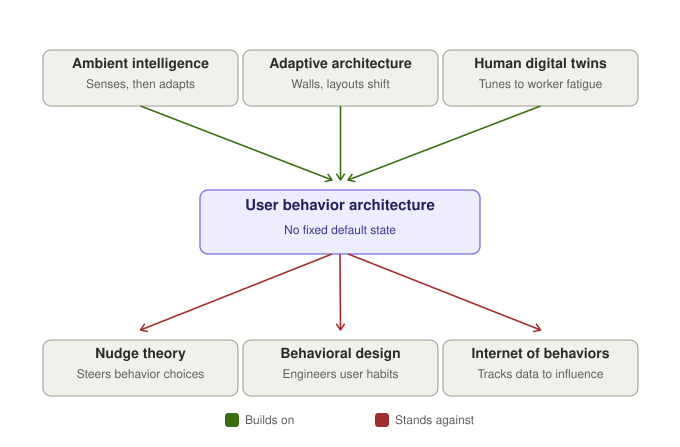
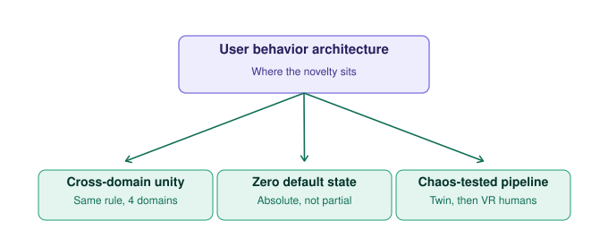

# The Tyranny of the Default: Toward a User Behavior Architecture

For as long as we've built things, designers have built fixed structures and asked people to adapt to them: a desk bolted to a classroom floor, a menu hierarchy a user has to learn, a workstation height set to a population average. This works passably on average and fails specifically, for the worker exhausted at four in the afternoon, the student who thinks differently than the curriculum assumes, the clinician whose hands are shaking. User Behavior Architecture (UBA) proposes the opposite premise: that the system, not the person, should have no fixed state, and that a person's own behavior, sensed in real time, should be the only blueprint the system needs.

This isn't a claim from nowhere. Ambient intelligence has argued since the late 1990s that environments should sense the people in them and adapt accordingly. Calm technology, articulated by Mark Weiser and John Seely Brown in 1995, made the same case for computing specifically: a system should ask for the smallest possible share of a person's attention. Architecture has its own decades-old answer in adaptive and responsive architecture, a recognized field studying buildings engineered to reconfigure around occupants in real time. In manufacturing, Industry 5.0's human digital twin research already uses live biometric data, heart rate, posture, fatigue, to retune a workstation to the specific person standing at it. Even informally, the idea has circulated for longer than any of these fields have existed, in the observation, common in landscape architecture and urban planning, that desire paths, the trails people wear into grass against an architect's paved sidewalk, are evidence that behavior is already a more honest blueprint than the design it's deviating from. UBA isn't claiming any of this is new. It's claiming these fields have been solving the same problem in isolation, under different names, without ever being unified into one explicit, cross-domain design principle.

What UBA does reject is a different, older lineage: behavioral design. Nudge theory, the Fogg Behavior Model, and the more recent Internet of Behaviors all treat human behavior as something to be read and then steered, toward a purchase, a habit, a compliance outcome the system wants. Traditional ergonomics and conventional UX design carry a quieter version of the same problem: they don't manipulate, but they do average, building one adjustable chair or one default menu for an imagined typical user and asking the real, particular person to do the adjusting. Across all of these, the locus of change is the human. UBA inverts that locus: the environment changes, the person does not.

What this genuinely solves is a failure mode that shows up across unrelated industries under different names: a tired worker fighting a fixed reach radius on an assembly line and developing a repetitive strain injury, a clinician losing seconds to a hospital bay's static equipment layout mid-trauma, a software user abandoning a task because a default menu structure doesn't match how they think. These look like separate problems because they happen in separate buildings and professions. They are the same problem: a static system demanding adaptation from a person who is, in the moment, fatigued, distracted, or simply not the average the system was built for.

A rigorous version of this theory doesn't need new mathematics, only borrowed mathematics. Cybernetics, going back to Norbert Wiener's 1948 formulation, is the original study of feedback between a system and its environment, and adaptive control theory is the engineering discipline built around systems that adjust their own parameters as conditions change; both already supply the formal language for a configuration that is a continuous function of sensed state. The AI core inferring fatigue or intent from ambiguous signals is naturally framed as a partially observable Markov decision process, the same formalism reinforcement learning already uses for decisions under uncertainty. And human performance itself has measurable, decades-old models to optimize against: Fitts's law for movement time as a function of distance and target size, and the Hick-Hyman law for decision time as a function of how many choices are presented. UBA's job isn't to write new equations. It's to make those existing equations the explicit objective function a self-reconfiguring environment is trying to minimize.

What UBA actually studies, then, isn't the human, that's physiology and psychology's territory, and it isn't the artifact, that's architecture and HCI's. It's the coupling between them: the continuously updated function, formally a control policy, mapping a stream of behavioral signal to a configuration change. That function is the object this theory proposes to design. Framing it this way matters practically, because it means a study can test the coupling directly, by varying it and measuring outcomes, instead of trying to test an entire building or interface all at once.

It's worth being precise about what this isn't a rebrand of. Agile and Lean already build iterative, feedback-driven adaptation into software and organizations, but they operate on the development process, in sprints measured in days, not on the deployed artifact in real time. Software's own self-adaptive systems research, the monitor-analyze-plan-execute loop formalized in IBM's autonomic computing work in the early 2000s, is the closest existing kin, since it already describes software reconfiguring itself against live telemetry. UBA's distinct move is widening that loop's scope from software alone to the physical, architectural world, and pairing it with a constraint autonomic computing never makes: the system may change anything except the demand that a person adapt.

None of this needs proving in a hospital or a factory first. The cleanest version of the claim is testable on a screen, with one repositioning target and a stopwatch, before it's ever asked to hold up in a trauma bay. The cross-domain claim and the validation pipeline are larger, later arguments, and deserve their own evidence rather than riding in on a single demonstration. What's actually new here isn't the sensing, the AI, or the idea that environments can adapt; all three already exist, independently, elsewhere. What's new is refusing to let the human be the variable.

## References

Åström, K. J., & Wittenmark, B. (1995). *Adaptive control* (2nd ed.). Addison-Wesley.

Davila-Gonzalez, S., & Martin, S. (2024). Human digital twin in Industry 5.0: A holistic approach to worker safety and well-being through advanced AI and emotional analytics. *Sensors, 24*(2), 655. https://doi.org/10.3390/s24020655

Fitts, P. M. (1954). The information capacity of the human motor system in controlling the amplitude of movement. *Journal of Experimental Psychology, 47*(6), 381–391.

Fogg, B. J. (2009). A behavior model for persuasive design. In *Proceedings of the 4th International Conference on Persuasive Technology* (Article 40). ACM. https://doi.org/10.1145/1541948.1541999

Hick, W. E. (1952). On the rate of gain of information. *Quarterly Journal of Experimental Psychology, 4*(1), 11–26.

Hyman, R. (1953). Stimulus information as a determinant of reaction time. *Journal of Experimental Psychology, 45*, 188–196.

Kaelbling, L. P., Littman, M. L., & Cassandra, A. R. (1998). Planning and acting in partially observable stochastic domains. *Artificial Intelligence, 101*(1–2), 99–134.

Kephart, J. O., & Chess, D. M. (2003). The vision of autonomic computing. *Computer, 36*(1), 41–50.

Nyman, G. (2012, March 16). *Internet of behaviors* [Blog post]. https://gotepoem.wordpress.com/2012/03/16/internet-of-behaviors-ib/

Schnädelbach, H. (2010). Adaptive architecture: A conceptual framework. In J. Geelhaar, F. Eckardt, B. Rudolf, S. Zierold, & M. Markert (Eds.), *MediaCity: Interaction of architecture, media and social phenomena* (pp. 523–555). Bauhaus-Universität Weimar.

Thaler, R. H., & Sunstein, C. R. (2008). *Nudge: Improving decisions about health, wealth, and happiness*. Yale University Press.

Weiser, M., & Brown, J. S. (1996). *The coming age of calm technology*. Xerox PARC.

Wiener, N. (1948). *Cybernetics: Or control and communication in the animal and the machine*. John Wiley & Sons.

Zelkha, E., Epstein, B., Birrell, S., & Dodsworth, C. (1998, June). *From devices to "ambient intelligence"* [Conference presentation]. Digital Living Room Conference.
